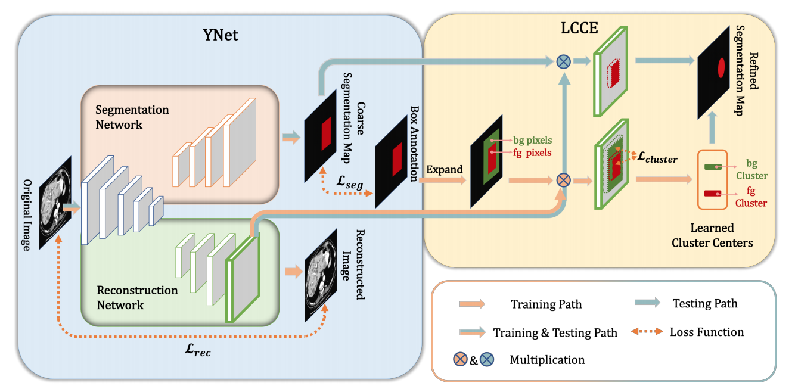
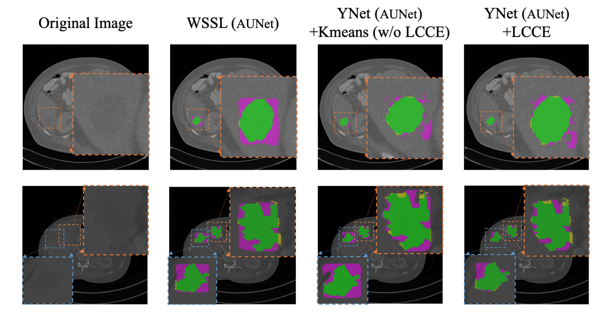

# YNet: A Y-shape Fully Convolutional Neural Network for Box-driven Weakly Supervised Medical Image Segmentation
This is Tensorflow implementation of our paper "YNet: A Y-shape Fully Convolutional Neural Network for Box-driven Weakly Supervised Medical Image Segmentation"

Our method aiming at segment the liver lesion with the box annotation.

The architecture of our proposed YNet is shown in here
 
The demo result is shown in here


## Run
1. Requirements
    - Python 2.7
    - Tensorflow 1.10.0
    - you can install the necessary packages by this command
    ```bash
    pip -r install requirements.txt
    ```
2. Prepare Dataset
    - Run the ISBI2017_to_tfrecords.py to generate tfrecords files. You need to modify the path source dir and the target dir.
    ```bash
    python datasets/ISBI2017_to_tfrecords.py
    ```
3. Run Training
    - train_segmentation.py (default is UNet based on VGG16)
    ```bash
    python -u ./train_segmentation_ISBI2017_UNet.py --train_dir=/home/give/PycharmProjects/weakly_label_segmentation/logs/ISBI2017_V2/UNet --num_gpus=1 --learning_rate=1e-4 --gpu_memory_fraction=1 --train_image_width=256 --train_image_height=256 --batch_size=4 --dataset_dir=/home/give/Documents/dataset/ISBI2017/weakly_label_segmentation_V4/Batch_2/tfrecords_V2_V2 --dataset_name=isbi2017v2 --dataset_split_name=train --max_number_of_steps=10000000 --checkpoint_path=/home/give/github/pixel_link/checkpoints/conv2_2/model.ckpt-73018 --using_moving_average=1 --decoder=upsampling
    ```
    - Explain the parameters
        - train_dir: the ckpt and tensorboard files will be saved in there.
        - train_image_width: the resized width
        - train_image_height: the resized height
        - dataset_dir: the path of tfrecord files
        - max_number_of_steps: the number of steps
        - checkpoint_path: pretrained model path
    
4. Run Evaluation 
    - evulate_segmentation_ISBI2017.py
    ```bash
    python -u ./evulate_segmentation_ISBI2017_V2.py --checkpoint_path=/home/give/PycharmProjects/weakly_label_segmentation/logs/ISBI2017_V2/1s_agumentation_weakly-upsampling-2/model.ckpt-168090 --dataset_dir=/home/give/Documents/dataset/ISBI2017/weakly_label_segmentation_V4/Batch_1 --pred_vis_dir=/home/give/Documents/dataset/ISBI2017/weakly_label_segmentation_V4/Batch_1/DLSC_0/pred_vis --pred_dir=/home/give/Documents/dataset/ISBI2017/weakly_label_segmentation_V4/Batch_1/DLSC_0/pred --recovery_img_dir=/home/give/Documents/dataset/ISBI2017/weakly_label_segmentation_V4/Batch_1/DLSC_0/recovery_img_step --recovery_feature_map_dir=/home/give/Documents/dataset/ISBI2017/weakly_label_segmentation_V4/Batch_1/DLSC_0/recovery_feature_map --decoder=upsampling --using_moving_average=1 --batch_size=2 --update_center=True --test_flag=False --num_centers_k=4 --nii_flag=False --full_annotation_flag=False
    ```